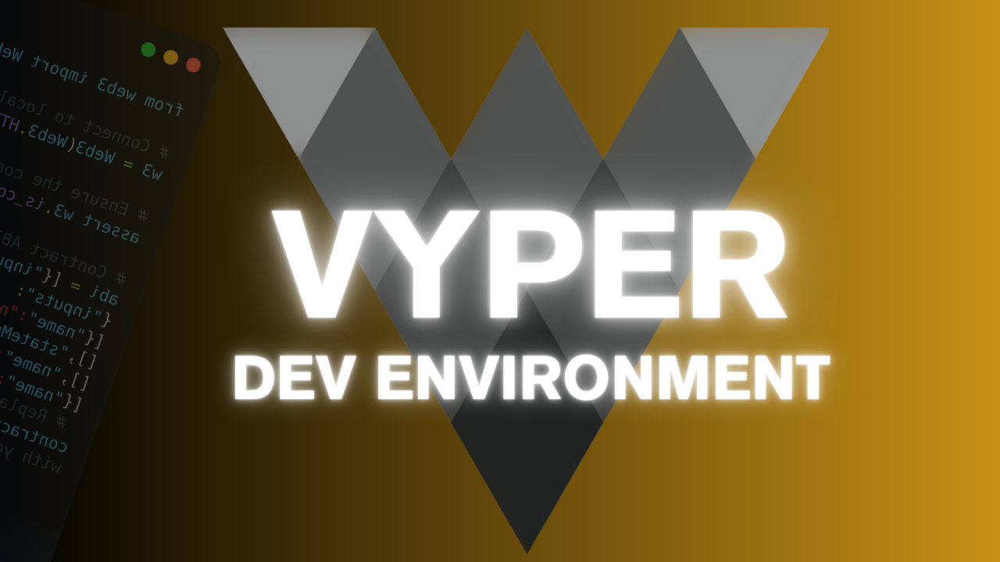

# Lesson 0 Setting up your Dev Environment

# Set Up
Go to this [Github repo](https://github.com/razacodespython/pyremix/tree/main) to clone your local environment

# Walk Through

Check out [this video]() if you want to see a walk through.